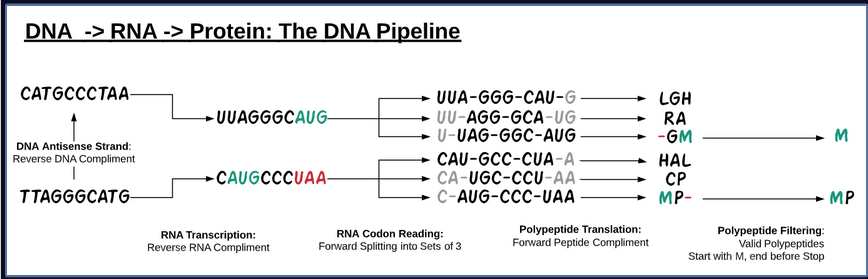

# DNATranslationTool
Native Python tools for translating DNA sequences to resulting proteins.

*Overview of the process*

## Full description of functions:
    - Creates a dictionary for DNA nucleotides
    - Makes a reverse complementary strand 
    - Makes reverse complementary strand of RNA (with U for A substitution)
    - Finds start codons
    - Gets codons from RNA strand
    - Creates list of corresponding amino acids with 3-letter codes
    
## Installation and Package Setup

Clone the Repository to your local computer.

## Example Workflow
- Provide DNA input

`insert code here`

